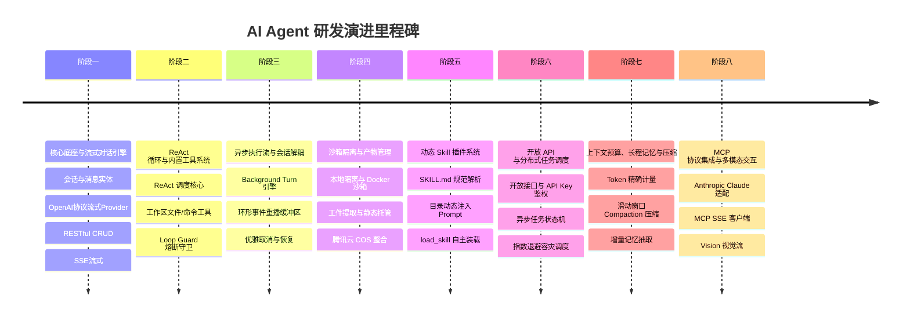
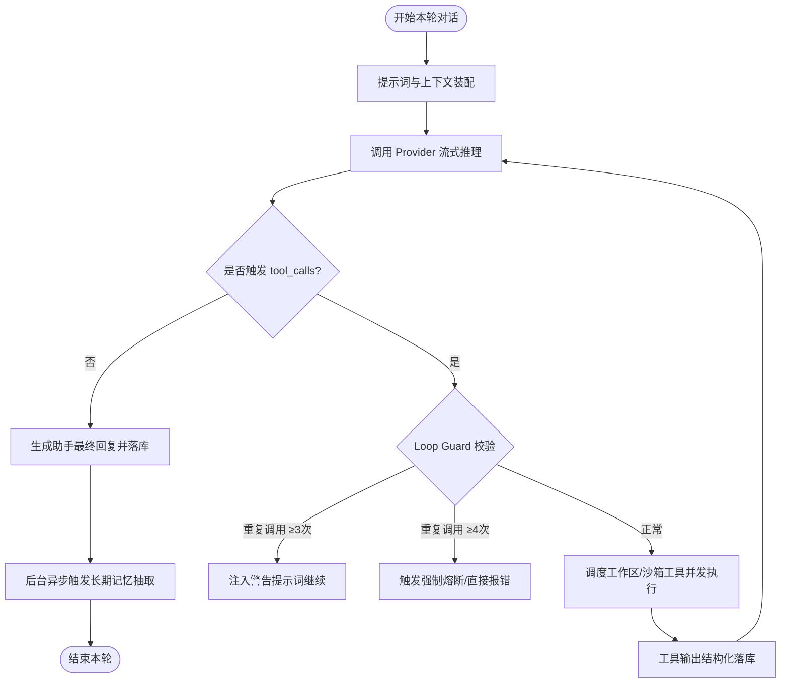

# AI Agent — 企业级全栈智能体引擎开发全景设计与演进路线

[](https://golang.org/)
[](LICENSE)
[]()
[]()

AI Agent 是一个基于 **Go (Golang)** 构建的高性能、高并发、生产级智能体（Agent）开发平台。系统对标 Claude Code 及前沿智能体系统规范，核心架构建立在 **统一多模型协议网关 + ReAct 自主执行循环 + 标准化 Skill 动态插件生态 + 安全隔离沙箱 (Docker / E2B) + 异步后台 Turn 引擎 + 模型上下文协议 (MCP) + 增量长期记忆与滑动窗口压缩 (Memory & Compaction)** 之上。

---

## 目录

- [一、核心设计哲学](#一定位与核心设计哲学)
- [二、全栈系统拓扑架构](#二全栈系统拓扑架构)
- [三、核心技术栈](#三核心技术栈)
- [四、八大演化阶段路线图（Roadmap）](#四八大演化阶段路线图roadmap)
- [五、核心模块技术深潜](#五核心模块技术深潜)
  - [5.1 异步解耦后台 Turn 引擎与 Replay 机制](#51-异步解耦后台-turn-引擎与-replay-机制)
  - [5.2 ReAct 工具调用循环与 Loop Guard 熔断守卫](#52-react-工具调用循环与-loop-guard-熔断守卫)
  - [5.3 动态 Skill 插件体系与自主装载 (load_skill)](#53-动态-skill-插件体系与自主装载-load_skill)
  - [5.4 模型上下文协议 (MCP) 接入规范](#54-模型上下文协议-mcp-接入规范)
  - [5.5 长期记忆网络与智能压缩 (Memory & Compaction)](#55-长期记忆网络与智能压缩-memory--compaction)
  - [5.6 隔离沙箱环境与工件产物提取](#56-隔离沙箱环境与工件产物提取)
- [六、协议规范](#六协议规范)
  - [6.1 SSE 实时流式事件协议](#61-sse-实时流式事件协议)
  - [6.2 开放接口 (Open API) 规范](#62-开放接口-open-api-规范)
- [七、工程目录规范](#七工程目录规范)
- [八、快速开始与本地开发](#八快速开始与本地开发)
- [九、编码与提交规范](#九编码与提交规范)

---

## 一、定位与核心设计哲学

传统的 LLM 应用多停留在简单的单轮 Prompt 包装或受限的 Chain 串联。AI Agent 定位于企业级通用与垂直自主决策智能体，遵循六大核心工程准则：

1. **生命周期与传输协议彻底解耦**：
   - 传统 SSE 模式下，客户端一旦刷新或网络中断，上游请求即刻熔断，造成执行进度丢失、残缺孤儿 `tool_calls` 与沙箱挂起。
   - 本系统采用 **Background Turn Runner**，将单轮交互的计算与执行托管至独立 Goroutine，客户端通过流式通道“旁听”，支持任意时点断线重连补播（Replay from Seq）。
2. **严密的死循环与参数预算守卫 (Loop Guard)**：
   - 模型在复杂长链路场景下可能陷入重复工具调用或参数溢出。系统内置“3 次告警、4 次强制熔断”防护网，并对工具入参及执行输出施加软硬件级上限约束。
3. **基于标准 SKILL.md 的动态插件注入**：
   - 工具过多会导致模型注意力分散与 Prompt 上下文过载。系统采用**目录摘要注入（Skill Catalog）+ 意图识别动态自主装载（`load_skill`）**模式，未启用技能按精简摘要入 System Prompt，由模型按需动态激活挂载。
4. **统一归一化多模型适配 (Multi-Provider Gateway)**：
   - 抹平 OpenAI 兼容协议（火山方舟豆包、DeepSeek、MiniMax、GLM 等）与 Anthropic Claude Messages 协议差异，精确核算包含 Prompt Token、Completion Token、Cache 命中与 Reasoning 推理 Token 在内的真实上下文水位。
5. **双轨模型上下文协议 (MCP) 扩展**：
   - 原生支持 Anthropic 发起的 **MCP (Model Context Protocol)**，通过标准 SSE / Stdio 传输层实现与全球第三方开发工具及数据源的无缝对接。
6. **两级记忆网络与自适应上下文压缩 (Memory & Compaction)**：
   - 跨会话长期记忆（Explicit 用户显式声明 + Extracted 后台静默抽取），基于滑动窗口水位触发智能剪枝与摘要折叠，规避超长窗口溢出与高额成本。

---

## 二、全栈系统拓扑架构

```
+-------------------------------------------------------------------------------------------------------+
|                                    客户端层 (Web UI / SDK / 开放 API 调用方)                                 |
+-------------------------------------------------------------------------------------------------------+
                                                     |
                                            HTTP / SSE / RESTful
                                                     v
+-------------------------------------------------------------------------------------------------------+
|                                        API 网关与路由控制层                                              |
|  /api/auth/*       /api/sessions/*       /api/skills/*       /api/memories/*      /api/v1/skill-runs   |
+-------------------------------------------------------------------------------------------------------+
                                                     |
                         +---------------------------+---------------------------+
                         v                                                       v
+---------------------------------------------------+   +-----------------------------------------------+
|         Background Turn Runner (后台解耦执行引擎)     |   |          Async Run Dispatcher (任务派发引擎)   |
|   - Goroutine 异步生命周期管理                      |   |   - 状态机驱动 (Pending/Running/Success/Failed)|
|   - 环形事件缓冲区 (Ring Buffer Replay)            |   |   - 错误分类感知与指数退避重试 (Exponential Backoff)|
+---------------------------------------------------+   +-----------------------------------------------+
                         |                                                       |
                         +---------------------------+---------------------------+
                                                     v
+-------------------------------------------------------------------------------------------------------+
|                                         Core ReAct Agent 核心循环                                      |
|                                                                                                       |
|  [1. 上下文预算检查] -> Context Meter 水位监测 / 超过 70% 触发 Compaction 压缩流水线                   |
|  [2. 提示词装配]   -> System Prompt + 长期记忆注入 + Skill Catalog 摘要 + 动态挂载工具描述             |
|  [3. 模型流式推理] -> Provider 归一化流式分发 (MiniMax / 豆包 / DeepSeek / Claude)                    |
|  [4. 增量事件广播] -> 推送 delta 增量、reasoning_content 推理链折叠流                                  |
|  [5. 工具调用调度] -> Loop Guard 熔断过滤 -> 并发/串行调度执行 -> 工具结果注入上下文                   |
|  [6. 产物与终态落库] -> 提取 Artifacts 工件 -> 落库消息实体 -> 异步触发长期记忆抽取                    |
+-------------------------------------------------------------------------------------------------------+
        |                     |                     |                     |                     |
        v                     v                     v                     v                     v
+---------------+     +---------------+     +---------------+     +---------------+     +---------------+
| 模型服务网关   |     | Skill 插件引擎|     | MCP 协议客户端|     | 隔离执行沙箱   |     | 记忆与数据存储 |
| - MiniMax     |     | - SKILL.md    |     | - SSE Client  |     | - Local Host  |     | - GORM/GEN    |
| - 火山方舟豆包|     | - 动态装载    |     | - Stdio Host  |     | - Docker 容器 |     | - MySQL 8.0   |
| - DeepSeek    |     | - 密钥隔离注入|     | - 工具动态映射|     | - E2B Cloud   |     | - Redis 缓存  |
| - Claude 3.5  |     | - 广场与版本  |     | - Resources   |     | - 产物持久化  |     | - 腾讯云 COS  |
+---------------+     +---------------+     +---------------+     +---------------+     +---------------+
```

---

## 三、核心技术栈

| 层次 | 技术选型 | 关键说明 |
| :--- | :--- | :--- |
| **基础语言** | Go 1.26+ | 原生并发模型、强类型安全保障、高性能网络 I/O 与小体积运行容器 |
| **Web 框架** | Gin Web Framework | 极高性能路由匹配、成熟的中间件生态与 SSE 流式输出机制 |
| **持久化层** | GORM + MySQL 8.0 | 强类型数据查询门面、事务传播机制，支持 Docker 一键拉起 |
| **辅助存储** | Redis 7.0 + 腾讯云 COS | 高性能会话缓存、分布式锁以及附件/工件文件对象存储 |
| **模型协议** | 自研归一化流式 Provider 网关 | 原生兼容 OpenAI 规范与 Anthropic Claude Messages 规范 |
| **沙箱隔离** | Docker Engine SDK / E2B | 容器化代码运行沙箱，网络隔离、只读挂载与超时自动销毁 |
| **外部生态** | Model Context Protocol (MCP) | 支持标准化 SSE 传输通道，动态挂载跨系统能力 |

---

## 四、八大演化阶段路线图（Roadmap）

本项目采用严谨的演化架构模式，将整套智能体系统的构建规划为八个渐进式研发阶段：



### 阶段一：核心底座与流式对话引擎 (Core Kernel & Streaming Engine)
- [x] 领域数据实体：`Session`（会话）、`Message`（消息）、用户与系统凭据管理
- [x] 统一 Provider 抽象：归一化 `StreamChunk`、`ToolCallDelta`、`Usage` 接口
- [x] 多模型流式接入：支持 MiniMax、火山方舟豆包、DeepSeek 等主流大模型
- [x] 会话生命周期管理：RESTful 会话列表、新建、重命名、删除及级联消息清理
- [x] 标准 SSE 实时流式传输：支持 `user_message_id`、`delta`、`done`、`error` 增量分发

### 阶段二：ReAct 循环与内置工具系统 (ReAct Loop & Workspace Tools)
- [x] 核心 Agent 执行器：多轮 ReAct (Reasoning + Acting) 闭环与并发工具执行
- [x] 内置工作区工具集：`read_file`、`write_file`、`edit_file`、`bash`、`python_exec`
- [x] 熔断守卫机制 (Loop Guard)：相同参数调用 3 次告警、4 次强制熔断；输出超限自动截断
- [x] 工具调用前端协议扩展：`tool_call_start`、`tool_call_result`、`tool_call_error`

### 阶段三：异步执行流与会话解耦 (Decoupled Background Turn Runner)
- [x] 核心执行与连接解耦：Turn 跑在后台 Goroutine 中，客户端刷新或掉线任务不中断
- [x] 环形事件缓冲区 (Ring Buffer Replay)：单轮 3000 条事件滑动保留，支持重连从指定 `seq` 补播
- [x] 会话级互斥并发锁：保障单会话时序一致性，提供优雅终止（Abort）与状态恢复

### 阶段四：沙箱隔离与产物管理 (Isolated Sandbox & Artifacts)
- [x] 多驱动沙箱架构：本地隔离运行与 Docker Container 容器沙箱无缝切换
- [x] 容器生命周期治理：按需拉起、环境隔离注入、只读挂载与超时强制销毁
- [x] 产物提取与存储体系：从工具输出中捕获提取工件（Artifacts），接入腾讯云 COS 存储

### 阶段五：动态 Skill 插件系统 (Dynamic Skill Plugin Engine)
- [ ] `SKILL.md` 规范解析器：解析 YAML 元数据、输入参数契约与执行脚本
- [ ] 动态目录注入 (Catalog Prompt)：未启用技能以精简“名字 + 用途摘要”进 System Prompt
- [ ] 意图驱动自主装载：模型根据用户诉求调用 `load_skill` 动态激活挂载工具；支持机密密钥注入

### 阶段六：开放 API 与分布式任务调度 (Open API & Async Run Dispatcher)
- [ ] 开放 API 接口契约：API Key 鉴权、公司/租户隔离与白名单策略
- [ ] 异步任务调度器 (`/api/v1/skill-runs`)：任务提交、状态轮询与持久化追踪
- [ ] 容灾重试派发引擎：错误分类器（网络抖动/限流/服务异常）与指数退避重试调度

### 阶段七：上下文预算、长程记忆与压缩 (Context Budget, Compaction & Long-Term Memory)
- [ ] 归一化 Token 审计：输入、输出、Cache 命中及 Reasoning Token 独立度量
- [ ] 智能压缩流水线 (Compaction Flow)：水位超阈值自动触发历史切分与摘要折叠
- [ ] 增量长程记忆提取 (Memory Extract)：对话完成后后台静默挖掘用户偏好，并注入全局 Prompt

### 阶段八：MCP 协议集成与多模态交互 (MCP Integration & Multimodal Modalities)
- [ ] Model Context Protocol (MCP) 客户端：基于 SSE Transport 接入外部标准化工具与资源
- [ ] Anthropic Claude 原生协议适配器：Messages 协议与流式双向映射
- [ ] 视觉与人机协同：Vision 图像多块识别接入；`request_input` 挂起机制实现人机交互确认

---

## 五、核心模块技术深潜

### 5.1 异步解耦后台 Turn 引擎与 Replay 机制

```text
HTTP Client (SSE)                Turn Registry                    Agent Core (Goroutine)
       |                               |                                    |
       |--- POST /sessions/:id/msg --->|                                    |
       |                               |--- Spawn Background Turn --------->|
       |                               |                                    | (Agent 独立运转)
       |<-- Stream Event (seq=0,1,2) --|                                    |
       |                               |<-- Emit Event (seq=0, 1, 2) -------|
  [网络突发中断]                        |                                    |
       x                               |    (缓冲区保留最近 3000 条事件)     |
                                       |                                    |
  [客户端重连]                          |                                    |
       |--- GET /stream?after_seq=2 -->|                                    |
       |<-- Replay (seq=3, 4, 5...) ---|                                    |
       |<-- Final Done Event ----------|<-- Finish Signal ------------------|
```

传统框架将 SSE 生成器直接绑定在 HTTP Request Handler 上。一旦用户手滑刷新页面或遭遇网络抖动，底层进程被迫终止，造成以下严重问题：
1. 模型正在进行的计算全部作废；
2. 历史库留下孤儿 `assistant(tool_calls)`，缺失后续对应的 `tool` 结果消息，导致历史记录破坏；
3. 沙箱中拉起的子进程或脚本无法正常回收。

本项目引入 **Background Turn Runner**：
- 接收到请求后，由内存注册表接管生命周期，后台 Goroutine 独立执行完整的 ReAct 循环与落库；
- HTTP/SSE 仅作为订阅者接收广播；
- 内置基于滑动窗口的事件环形队列（Ring Buffer），客户端重新建立连接时携带 `after_seq`，引擎自动补播丢失的事件帧。

### 5.2 ReAct 工具调用循环与 Loop Guard 熔断守卫



- **参数上限防护**：单次 `tool_call` 的 arguments 超过 40KB 自动拦截；
- **输出截断护栏**：工具执行标准输出若超过预设阈值（如 80KB），自动执行保守截断并追加超限标记，保护上下文窗口；
- **防震荡算法**：对模型发起的工具调用签名（`name + arguments`）计算指纹，单轮连续 3 次相同调用发起警示，4 次直接熔断终止。

### 5.3 动态 Skill 插件体系与自主装载 (load_skill)

标准 `SKILL.md` 采用声明式格式：
```markdown
---
name: fetch-url
description: 提取目标网页的 HTML 内容并转换为结构化 Markdown
parameters:
  type: object
  properties:
    url:
      type: string
      description: 目标网址
  required: [url]
---
# Fetch URL Skill
通过沙箱内置脚本完成指定网页的数据抓取。
```

- **Catalog 模式**：未被显式激活的技能仅提取 `name` 和 `description` 摘要构建轻量索引进入 System Prompt；
- **自主装载**：当用户提出对应需求（如“帮我读一下这个网页”），模型自动决策调用内置 `load_skill(name="fetch-url")`，引擎实时将该技能完整的 Schema、入参规范及沙箱执行指令挂载进当前会话工具集。

### 5.4 模型上下文协议 (MCP) 接入规范

系统原生兼容开放标准 **Model Context Protocol (MCP)**：
- 支持通过 SSE 与第三方独立部署的 MCP Server 握手建立连接；
- 协议层自动发现并同步远端工具列表（Tools Discovery）；
- 将远端 MCP 工具自动平滑转换为 Agent 内置的 Function Calling 规格，无缝参与 ReAct 调度。

### 5.5 长期记忆网络与智能压缩 (Memory & Compaction)

```text
[用户对话产生] ---> 触发增量记忆提取器 (Memory Extract) ---> 提取偏好/事实
                                                                    |
                                                                    v
[System Prompt] <--- 检索注入相关条目 <--- 长期记忆库 (Memory PO) <---+
```

- **记忆分类与提取**：分为用户显式声明（`manual`）与后台静默提取（`extracted`），涵盖全局用户偏好、项目背景与约束；
- **容量上限与淘汰机制**：每个主题（Topic）限制最大容量（如 50 条），90 天未命中结合 LRU 规则自动衰减淘汰；
- **上下文压缩管道 (Compaction Flow)**：
  - 实时监控会话真实 Context Token 水位；
  - 水位突破窗口 70% 时，触发非破坏性压缩：自动寻找安全切割点（Cut Point），调用低成本模型将前半段上下文提炼为 `SessionDigest` 摘要，替换历史冗余消息。

### 5.6 隔离沙箱环境与工件产物提取

- **沙箱运行态**：每个会话分配独立的工作目录与隔离环境（本地受限或 Docker 容器）；
- **产物拦截 (Artifacts Export)**：当工具执行生成文件（如图片、CSV、PPT 等），沙箱调度器自动拦截输出并提取为工件元数据，生成可下载的文件下载链接或同步挂载至腾讯云 COS。

---

## 六、协议规范

### 6.1 SSE 实时流式事件协议

客户端与服务端流式通道通过标准 `text/event-stream` 进行交互。每个事件均为标准单行 JSON，
并携带 `id: {seq}` 单调递增游标（断线重连时携带最后游标 +1 作为 `from_seq` 补播）；
空闲超过 15 秒发送 `: ping` 注释行心跳，防止反向代理掐断空闲连接：

```text
data: {"type": "user_message_id", "id": "msg_01h7..."}

id: 1
data: {"type": "delta", "content": "好的，正在为您分析代码..."}

id: 2
data: {"type": "tool_call_start", "id": "call_123", "name": "read_file", "arguments": "{\"path\": \"main.go\"}"}

id: 3
data: {"type": "tool_call_result", "id": "call_123", "output": "package main..."}

id: 4
data: {"type": "delta", "content": "根据 main.go 的内容..."}

id: 5
data: {"type": "done", "id": "msg_01h8...", "usage": {"prompt_tokens": 125, "completion_tokens": 48}}
```

对话轮次由后台 Turn 引擎独立执行，SSE 连接仅作为订阅者：刷新或断线不影响执行，
`GET /api/sessions/:id/stream?from_seq=N` 从环形缓冲（单轮 3000 条滑动保留）补播丢失事件；
`POST /api/sessions/:id/messages/stop` 优雅中止当前轮次（已生成的部分回答照常落库）。

#### 事件类型映射表

| 事件类型 (`type`) | 携带参数 | 作用与含义 |
| :--- | :--- | :--- |
| `user_message_id` | `id` | 用户消息写入数据库后的持久化 UUID（用于前端更新临时消息项） |
| `delta` | `content`, `reasoning` | 模型流式生成的增量正文及思维链（Reasoning）文本片段 |
| `tool_call_start` | `id`, `name`, `arguments` | 宣布发起工具调用并传递初始参数片段 |
| `tool_call_result`| `id`, `output` | 工具执行结束返回的结构化执行结果 |
| `tool_call_error` | `id`, `error` | 工具执行发生超时、权限违背或运行错误时的反馈 |
| `tool_artifact`  | `tool_call_id`, `attachment` | 工具（`export_artifact`）导出的产物工件：上传对象存储后的可预览附件 |
| `memory_written`  | `key`, `topic`, `content` | 模型自动识别并写入长期记忆库时下发的可视化提醒 |
| `done`            | `id`, `usage` | 助手完整消息完成落库，返回最终消息 UUID 及 Token 审计信息 |
| `error`           | `message` | 执行链路出现无法恢复的系统异常报错 |

### 6.2 开放接口 (Open API) 规范

除了面向 Web UI 的会话接口，系统对外提供带 API Key 鉴权的开放异步执行规范：

| 请求方法 | 路由路径 | 接口职责与功能 |
| :--- | :--- | :--- |
| `POST` | `/api/sessions` | 创建新会话 |
| `GET` | `/api/sessions` | 分页获取当前用户的历史会话列表 |
| `GET` | `/api/sessions/:id` | 获取特定会话详情及完整历史消息 |
| `PATCH` | `/api/sessions/:id` | 修改会话标题 |
| `DELETE` | `/api/sessions/:id` | 删除会话及级联清理历史记录与摘要 |
| `POST` | `/api/sessions/:id/messages` | 发起流式对话（SSE 协议长连接，轮次在后台 Turn 引擎执行） |
| `POST` | `/api/sessions/:id/messages/stop` | 优雅中止该会话正在进行的轮次（幂等） |
| `GET` | `/api/sessions/:id/stream` | 断线重连补播（`from_seq` 游标；`live_only=1` 仅接在跑轮次，无可接返回 204） |
| `GET` | `/api/models` | 获取当前环境支持的模型矩阵与默认窗口上限 |
| `GET` | `/api/memories` | 检索与管理长期记忆实体 |
| `POST` | `/api/v1/skill-runs` | 开放异步 Skill 任务提交接口（API Key 鉴权） |
| `GET` | `/api/v1/skill-runs/:run_id`| 轮询异步任务执行状态与执行结果 |

---

## 七、工程目录规范

```text
ai-agent/
├── backend/                       # Go 后端核心系统
│   ├── api/                       # 控制层（会话、聊天、技能、开放接口）
│   │   ├── auth.go                # 登录鉴权路由
│   │   ├── chat.go                # SSE 流式聊天及中断控制
│   │   ├── models.go              # 模型列表接口
│   │   └── sessions.go            # 会话 CRUD 路由
│   ├── config/                    # Viper 统一配置解析
│   │   └── config.go              # 数据库、LLM、沙箱、COS 结构化配置
│   ├── dal/                       # 数据访问层
│   │   ├── model/                 # 数据模型实体 (Session, Message, Memory 等)
│   │   └── query/                 # GORM 强类型查询门面
│   ├── dao/                       # 业务级数据访问封装
│   │   ├── message.go             # 消息落库与历史读取
│   │   └── session.go             # 会话持久化与状态更新
│   ├── etc/                       # 配置文件目录
│   │   └── config.yaml            # 系统核心配置文件
│   ├── pkg/                       # 核心基础设施与底层组件
│   │   ├── agent/                 # Agent 执行内核、Turn 调度器与 Loop Guard
│   │   ├── apiwarp/               # 泛型 Controller 适配器与统一响应
│   │   ├── db/                    # 数据库初始化、连接池与事务传播
│   │   ├── errors/                # 统一业务错误与调用栈追踪
│   │   ├── jwt/                   # JWT 鉴权解析中间件
│   │   ├── log/                   # 结构化日志 (Slog + 日志轮转)
│   │   ├── mcp/                   # Model Context Protocol (MCP) 客户端
│   │   ├── memory/                # 长期记忆检索与 Compaction 压缩流水线
│   │   ├── provider/              # LLM 统一接口与流式适配器 (OpenAI / Claude)
│   │   ├── sandbox/               # 本地受限执行与 Docker 容器沙箱
│   │   ├── skill/                 # SKILL.md 解析器与动态装载调度
│   │   └── storage/               # 腾讯云 COS 与本地存储驱动
│   ├── go.mod                     # Go 依赖版本清单
│   ├── main.go                    # 服务启动入口
│   └── router.go                  # 路由组装与中间件装配
├── deploy/                        # 部署与运维配置
│   ├── docker-compose.yml         # 本地开发 MySQL / Redis 容器化编排
│   └── Caddyfile                  # 生产反向代理配置
├── .gitignore                     # 统一 Git 忽略规则
└── README.md                      # 系统全景架构设计与演进路线图
```

---

## 八、快速开始与本地开发

### 1. 启动本地基础中间件 (Docker)

进入部署目录并一键启动 MySQL 与 Redis 基础服务：

```bash
cd deploy
docker compose up -d
```

### 2. 检查与调整配置文件

修改 `backend/etc/config.yaml` 中的模型 Key 与数据库配置：

```yaml
Server:
  Port: 8888
  IP: 0.0.0.0

DBConf:
  Driver: "mysql"
  Path: "127.0.0.1:3306"
  DbName: "ai_agent"
  Username: "root"
  Password: "your_mysql_password"

LLM:
  DefaultModel: "MiniMax-Text-01"
  Providers:
    - Name: "minimax"
      BaseURL: "https://api.minimaxi.com/v1"
      ApiKey: "sk-..."
```

### 3. 启动后端引擎

```bash
cd backend
go run main.go
```

控制台输出：
```text
[INFO] 数据库连接就绪，数据表迁移完成
[INFO] LLM Provider [minimax] 注册成功
[INFO] 服务启动成功，监听地址: 0.0.0.0:8888
```

### 4. 接口验证测试

**新建会话**：
```bash
curl -X POST http://127.0.0.1:8888/api/sessions \
  -H "Content-Type: application/json" \
  -d '{"title": "Go 并发特性探索", "model": "MiniMax-Text-01"}'
```

**发起流式对话**：
```bash
curl -N -X POST http://127.0.0.1:8888/api/sessions/{SESSION_ID}/messages \
  -H "Content-Type: application/json" \
  -d '{"content": "请用一段 Go 代码演示如何实现一个安全的 Worker Pool 并做简要说明"}'
```

---

## 九、编码与提交规范

- **提交规范**：严格遵循 [Conventional Commits](https://www.conventionalcommits.org/) 规范，保持提交信息语义清晰规范：
  - `feat`: 新功能开发（如 `feat(chat): implement sse streaming chat`）
  - `fix`: 问题修复（如 `fix(provider): handle missing reasoning tokens`）
  - `docs`: 文档变动（如 `docs: update mcp integration specifications`）
  - `chore`: 依赖调整与工程配置构建
- **分支原则**：主干开发模式（Trunk-Based），全部已验证功能直接在 `main` 分支演进。
